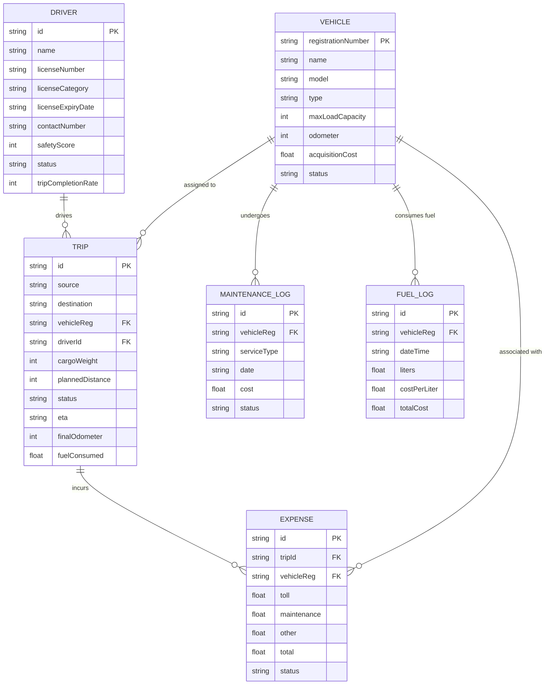

# Database Migration Plan & Analysis

This plan proposes migrating the **TransitOps** platform from client-side `localStorage` to a traditional relational database (SQLite/PostgreSQL) with a Node.js/Express backend.

---

## Codebase Analysis & Data Relationships

The application has several core models defined in `src/types.ts` that represent transit and fleet operations. These models are highly relational:



### Recommendation: SQLite (Local) / PostgreSQL (Cloud)
Since the data models have clear relational boundaries and foreign key constraints (e.g., `vehicleReg` and `driverId` in `Trip`), a **Relational (SQL) Database** is the perfect fit.

1. **Development/Local Demo**: **SQLite** (via `better-sqlite3` or Prisma)
   - *Why*: SQLite stores the database as a single file (`dev.db`) in your project folder. No database server needs to be installed, making the project instantly runnable by anyone checking out the repository.
2. **Production Deployment**: **PostgreSQL** (e.g., Supabase or Neon)
   - *Why*: If you deploy to Google Cloud Run (as indicated by your `.env.example`), SQLite isn't ideal because Cloud Run containers are stateless (restarts would wipe the DB file). Switching to PostgreSQL for production is seamless if using an ORM like **Prisma**.

---

## Proposed System Architecture

To support a database, we will run a backend Express server alongside our Vite frontend:

1. **API Server**: An Express backend in the root folder (`server.ts` or `src/server.ts`).
2. **API Proxy**: Configure Vite to proxy `/api` requests to the Express server during development.
3. **Database Client (ORM)**: **Prisma** to handle DB connections, migrations, and auto-generated TypeScript clients matching our exact types.

---

## Proposed Changes

### [Backend Foundation]

#### [NEW] [schema.prisma](file:///e:/Odoo/Odoo%20Sept/prisma/schema.prisma)
Define the database schema using Prisma:
```prisma
datasource db {
  provider = "sqlite"
  url      = "file:./dev.db"
}

generator client {
  provider = "prisma-client-js"
}

model Vehicle {
  registrationNumber String           @id
  name               String
  model              String
  type               String
  maxLoadCapacity    Int
  odometer           Int
  acquisitionCost    Float
  status             String
  trips              Trip[]
  maintenanceLogs    MaintenanceLog[]
  fuelLogs           FuelLog[]
  expenses           Expense[]
}

model Driver {
  id                 String   @id
  name               String
  licenseNumber      String
  licenseCategory    String
  licenseExpiryDate  String
  contactNumber      String
  safetyScore        Int
  status             String
  tripCompletionRate Int
  trips              Trip[]
}

model Trip {
  id              String    @id
  source          String
  destination     String
  vehicleReg      String
  driverId        String
  cargoWeight     Int
  plannedDistance Int
  status          String
  eta             String
  finalOdometer   Int?
  fuelConsumed    Float?
  vehicle         Vehicle   @relation(fields: [vehicleReg], references: [registrationNumber])
  driver          Driver    @relation(fields: [driverId], references: [id])
  expenses        Expense[]
}

model MaintenanceLog {
  id          String   @id
  vehicleReg  String
  serviceType String
  date        String
  cost        Float
  status      String
  vehicle     Vehicle  @relation(fields: [vehicleReg], references: [registrationNumber])
}

model FuelLog {
  id           String   @id
  vehicleReg   String
  dateTime     String
  liters       Float
  costPerLiter Float
  totalCost    Float
  vehicle      Vehicle  @relation(fields: [vehicleReg], references: [registrationNumber])
}

model Expense {
  id          String   @id
  tripId      String
  vehicleReg  String
  toll        Float
  maintenance Float
  other       Float
  total       Float
  status      String
  trip        Trip     @relation(fields: [tripId], references: [id])
  vehicle     Vehicle  @relation(fields: [vehicleReg], references: [registrationNumber])
}

model SystemConfig {
  id              Int    @id @default(1)
  depotName       String
  defaultCurrency String
  distanceUnit    String
  timezone        String
}
```

#### [NEW] [server.ts](file:///e:/Odoo/Odoo%20Sept/server.ts)
Create a lightweight Express backend that listens on port `3001` (or dynamic port) and serves REST API endpoints:
- `GET /api/data`: Returns current vehicles, drivers, trips, maintenance logs, fuel logs, expenses, and config.
- `POST /api/vehicles`, `PUT /api/vehicles/:reg`, etc. for CRUD.
- Seeds the SQLite database automatically on startup if it's empty, using the values in `initialData.ts`.

#### [MODIFY] [vite.config.ts](file:///e:/Odoo/Odoo%20Sept/vite.config.ts)
Add a server proxy configuration so the frontend requests to `/api/*` are transparently routed to `http://localhost:3001`.

---

## Verification Plan

### Automated Verification
- Verify Prisma database generation: `npx prisma db push`
- Verify backend API compilation and server startup.

### Manual Verification
- Access the web interface on port `3000`.
- Perform actions (e.g., adding a vehicle, dispatching a trip) and verify that the data persists across hard-browser-refreshes (which confirms it's reading/writing from/to the backend instead of just browser-memory/localStorage).
